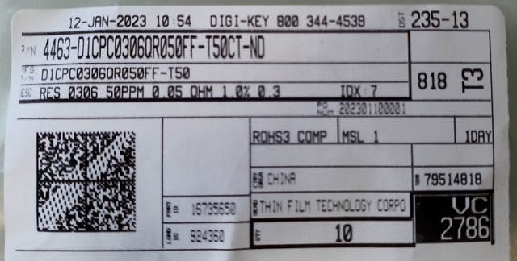

# DigiKey Barcode Decoder
This software reads the barcode string from DigiKey 
Product2DBarcode on the anti-static bag. 
The barcode scanner is assumed to be connected as a Virutal COM port device.

Following image shows an example of such a barcode:

Barcode string is:

`[)>.06.P4463-D1CPC0306QR050FF-T50CT-ND.1PD1CPC0306QR050FF-T50.K202301100001.1K79514818.10K94852328.11K1.4LCN.Q10.11ZPICK.12Z16735650.13Z924360.20Z000000000000000000000000000000000000000000000000000000000000000000000000000000000000000000000000000000000000000000000000000000000000000000000000`

Header is `[)>` and each field seems to be separated by a space or a period. 

Decoded fields follows after the header, each field has prefix indicating type and perhaps maximum length: 

|Useful|Field|Prefix|Value|
|------|-----|-----|-----|
|Yes|Part Number | 06P | 4463-D1CPC0306QR050FF-T50CT-ND|
|Yes|MFG Part Number |1P |D1CPC0306QR050FF-T50|
|Yes|Purchase Order | K |202301100001|
|No|SO Number | 1K |79514818 |
|No|Unknown | 10K |94852328|
|No|Unknown | 11K | 1 |
|No|Country of Origin | 4L | CN |
|Yes| Quantity | Q | 10 |
|No| Unknown | 11Z | PICK |
|No| Part ID | 12Z | 16735650|
|No| Load ID | 13Z | 924360|
|No| Unknown | 20Z| 000000 |