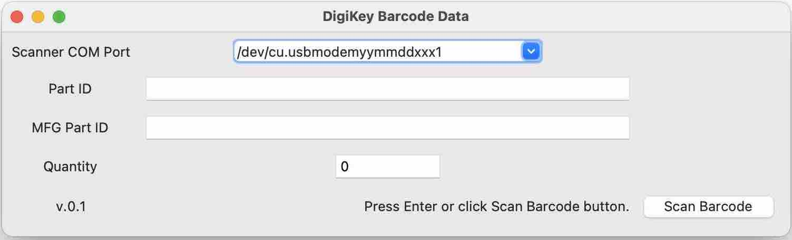
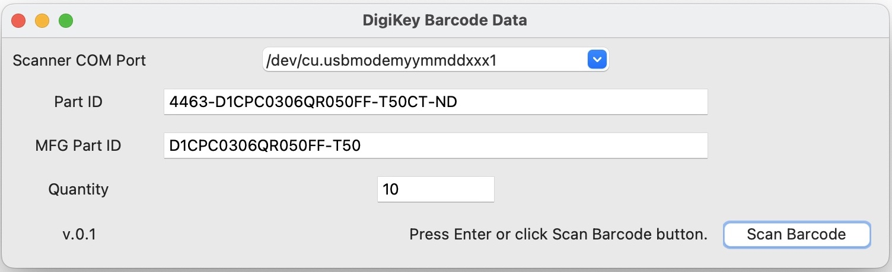

# DigiKey Barcode Decoder

## Motivation
DigiKey is the best! 

I try to maintain inventory of parts. This needs a search for component information with either the manufacturer part number or the DigiKey part number. 
Some of these fields are much longer than what you can quickly type, hence a simple tool to decode the barcode.

<!-- toc -->

## DigiKey Barcode Format
Reference:

https://forum.digikey.com/t/digi-key-barcodes/7332

This software reads the barcode string from DigiKey 
Product2DBarcode on the anti-static bag. 
The barcode scanner is assumed to be connected as a Virutal COM port device.

Following image shows an example of such a barcode:

I have configured my barcode scanner to read upto last five zeros and it also sends type of barcode as prefix `]d1[`. Actual barcode information starts with `[)>`, including.
Barcode string in Python's `byte` format is as follows:

`b']d1[)>\x1e06\x1dP4463-D1CPC0306QR050FF-T50CT-ND\x1d1PD1CPC0306QR050FF-T50\x1dK202301100001\x1d1K79514818\x1d10K94852328\x1d11K1\x1d4LCN\x1dQ10\x1d11ZPICK\x1d12Z16735650\x1d13Z924360\x1d20Z00000'`

Header is `[)>` and each field seems to be separated by a space or a period. 

Decoded fields follows after the header, each field has prefix indicating type and perhaps maximum length: 

|Useful|Field|Prefix|Value|
|------|-----|-----|-----|
|Yes|Part Number | 06P | 4463-D1CPC0306QR050FF-T50CT-ND|
|Yes|MFG Part Number |1P |D1CPC0306QR050FF-T50|
|Yes|Purchase Order | K |202301100001|
|No|SO Number | 1K |79514818 |
|No|Unknown | 10K |94852328|
|No|Unknown | 11K | 1 |
|No|Country of Origin | 4L | CN |
|Yes| Quantity | Q | 10 |
|No| Unknown | 11Z | PICK |
|No| Part ID | 12Z | 16735650|
|No| Load ID | 13Z | 924360|
|No| Unknown | 20Z| 000000 |

The barcode can be used along with DigiKey's web API to obtain information in JSON format.
More information at https://developer.digikey.com/products/barcode/barcoding/product2dbarcode.
Supported Barcode Scanner:
1. Honeywell N5600 camera based scanner with USB interface in COM emulation mode.

## How to install?

* Python Version tested on: **3.11**
* OS Supported: **Linux or macOS**

1. Clone the repository.
2. Create Python virtual environment with:
   
   `python -m venv <path where to create>` 
   
   e.g. `python -m venv ~/.virtualenvs/digikeybarcode`.
3. Activate virtual environment using: 
4. Install the dependencies using `pip install -r requirements.txt`.
5. Run the program using: `python src/user_interface.py`.

## How to use?
* Connect the USB barcode scanner to the computer and make sure it works beforehand.
* When the software starts, it will scan for COM ports with product ID **N5600** and selects it.
* Then the empty user interface (UI) is loaded which shows selected virtual COM Port as follows:

Ready your DigiKey pack with barcode.
When you press Enter or click on Scan Barcode button, the scanner will trigger scanning mode.
Once it scans it will be a couple of seconds before the data gets filled into the text boxes.

By default, the Part ID is automatically copied to the System Clipboard.
